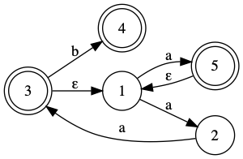

## Assignment 1 Description
Purpose of the assignment is to implement a Java Lexer using ANTLR and simulate an NFA diagram using Java Code.

### Table of Contents
1. Write a Lexer Grammar
2. NFA Simulation

### Part 1: Write a Lexer Grammar
Implement a Java lexer using Antlr and use the generated lexer to implement the function:

 ```java
   public static Stream<MyToken> analyze(String filename)
```
where `MyToken` is a simple class:
```java
   class MyToken {
     String tokenType;
     String lexeme;
   }
```

Consider the following token types that apply to the Java programming langugage:

- `KEYWORD_<name>` where `<name>` can be
  any one of: `import`, `public`, `class`, ...
  https://en.wikipedia.org/wiki/List_of_Java_keywords

- puntuations:
  '=', `<`, `>`, `(`, `)`, `[`, `]`, `{`, `}`, `;`

- arithmetic operators
  `+`, `-`, `*`, `/`, `%`

- identifier
  > - main
  > - Arrays
  > - asList

- member
  > - `.out`
  > - `.println`

- numbers
  > - 123
  > - 123.456F
  > - 3.1415f

- strings
  > - "hello"
  > - "name is \\"Albert Einstein\\""

- comments
  > ```
  > // single line comment
  > ```

- block comment
  > ```
  > /* 
  > This is a mult-line
  > block comment.
  > */
  > ```

### Part 2: NFA Simulation
Provide an implementation of NFA.
```java
public class NFA {
  public NFA addStates(int... states);
  public NFA start(int state);
  public NFA transition(int start, int end, char symbol);
  public NFA epsilon(int start, int end);
  public NFA finalStates(int... states);
  public boolean accept(String input);
}
```

The `NFA` class provides an API to build arbitrary NFA with
epsilon-transitions.

Here is an example of how NFA should work.

> Consider the following NFA.
>
> </img>
> 
> The initial state is `1`, and the final states are `{3, 4, 5}`.  This can be
> represented as:
> 
> ```java
> NFA A = new NFA()
>     .addStates(1,2,3,4,5)
>     .start(1)
>     .transition(1, 2, 'a')
>     .transition(2, 3, 'a')
>     .epsilon(3, 1)
>     .transition(3, 4, 'b')
>     .transition(1, 5, 'a')
>     .epsilon(5, 1)
>     .finalStates(3, 4, 5);
> 
> String s = "aaaab";
> if(A.accept(s))
>   System.out.println("Accepted.");
> else
>   System.out.println("Not accepted.");
> ```
