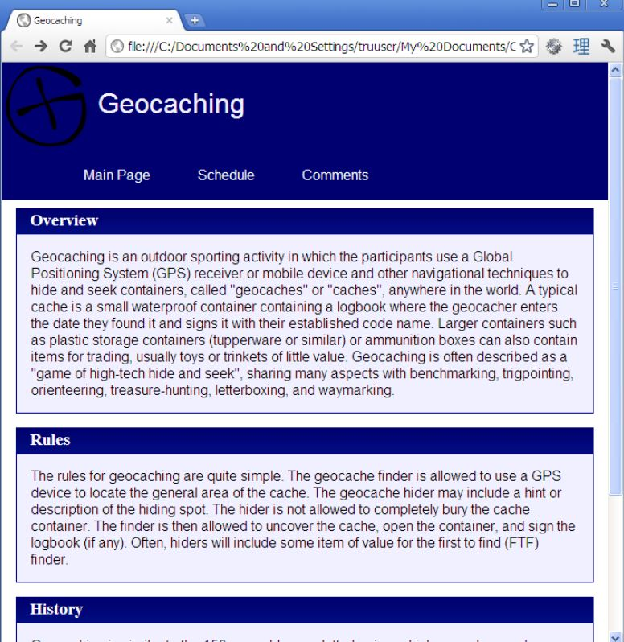

# Assignment 1
Purpose of this assignment is demonstrate my HTML, CSS and JavaScript understanding and implementation.
## Table of Contents
* Part 1: HTML
* Part 2: CSS
* Part 3: JavaScript

### Part 1: HTML
A simple website, using only HTML. The general requirements are outlined below, and specifics will be described in the text that follows.

> You are expected to choose a sport or game that you like to play or watch, and create a simple website about that sport or game.  Your website should provide useful information about people new to the sport/game or new to the area, in finding more about local participants.  Each of the three pages should provide links to each other page

The website will consist of three HTML files:
1. Main Page
> This page will contain information about the game or sport, including a (brief) description of its rulesand a brief description of its history (however, historical accuracy is not a requirement).  Use headings to separate sections of the web page appropriately (e.g. “Overview”, “Rules”, and “History”).  You should also include a list of relevant pages, where someone could explore to find out more information about your sport or game.

2. Schedule
> This page will use an HTML table to display a monthly calendar for some month (choose any monththat has relevant events), which shows some important events in your game or sport.  If you choose a sport that is not televised or played locally, you can make up some events, use events happening far away, or even use your own personal plans to play as events.  The calendar should show all days of the month, using a table with 7 days per week, and each week shown as a row in the table.  Include table headers to label the month, and days of the week.  Also include the day of month either in the cell itself (with the events), or as a cell immediately above the events.

3. Comments
> This page will be used by your users to submit comments, at a later time.  For now, simply include two sample comments, followed by a form to submit a comment of your own.  The form will not be functional, but should look correct otherwise.  The form should include text fields for the date, author name, title, and a multi-line text area for the comment text.

### Part 2: CSS
Create a style and layout, using CSS, for the webpages you've created in part 1.

Use the following figure as a guide when styling the document
> </img>

The style will consist of the following:
1. Header
> Each page should have a header section (using 
s), with an image (the same image from assignment #1 is acceptable) and a title. The title should be in white 24pt font, centred vertically beside the image. The background of the whole header should be a dark blue (e.g. #000070). Use the CSS class ‘pageHeader’ for this styling.
2. Navigation Bar
> Each page should have a link to all three pages. The easiest way to do this is to include alist (e.g. <ul> with one <li> for each link, each containing an <a> tag). This whole list will be inside its own 
 tag also. Use CSS to ensure that the list items are printed without a bullet icon, and are drawn horizontally. Change the font of the links so that there is no underline, and it uses bold, light blue (e.g. #f0f0ff) text. Use the CSS class ‘navigation’ for this styling

3. Main Page and Comments Page

The original main page had three sections (Overview, Rules, and History). Now, each of these sections should be in their own window-like box. The same should be done for comments (and the comments form) in the comments page. Put each of the three sec-tions into a 
, and wrap both the header (in a div with class ‘header’) and the text (in a div with class ‘body’) in 
 tags.The header should use white text on a dark background. Use 0.2 times the height of a capital M as padding around the text inside the header, except for the left side which should use a whole capital M worth of spacing (hint: padding-left).The body should be surrounded in a single-pixel, solid, dark blue (e.g. #000070) border. Its background colour should be a very light blue (e.g. #f0f0ff). Around all of the text should be padding equal to the size of a capital M.Here is the tricky part. Between the header and body, there should be no vertical blank space. See figure 1 for details. The trick here is to set certain margins to zero. Careful! When using zero for a width or height value, don’t use 0px, just use 0. Browsers often ig-nore values such as 0px, but work properly for just 0

4. Schedule
Modify the schedule table so that the table has a single-pixel, solid dark blue (e.g. #000070) border, instead of the default outset border. Set the width of the table to be 100% of the width of its container 
. If you have no container, 100% of the body widthis also acceptable.

## Part 3: JavaScript
Create a simple, interactive Tic Tac Toe game for two players playing from the same browser